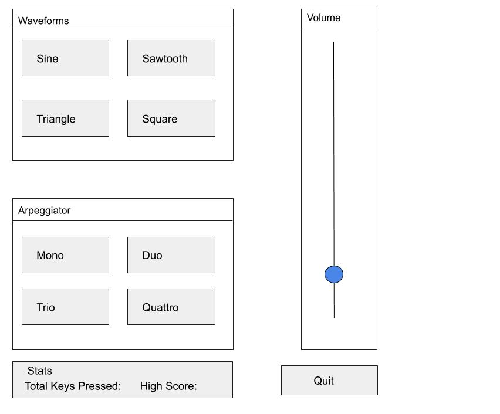
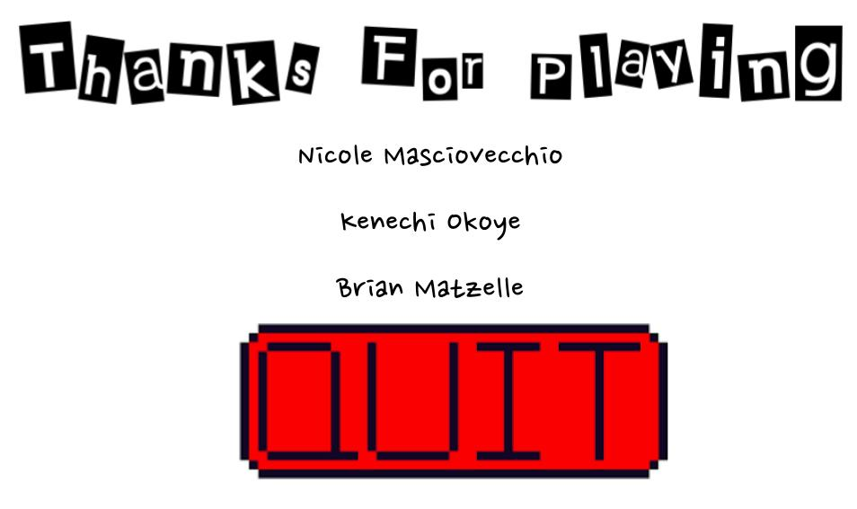
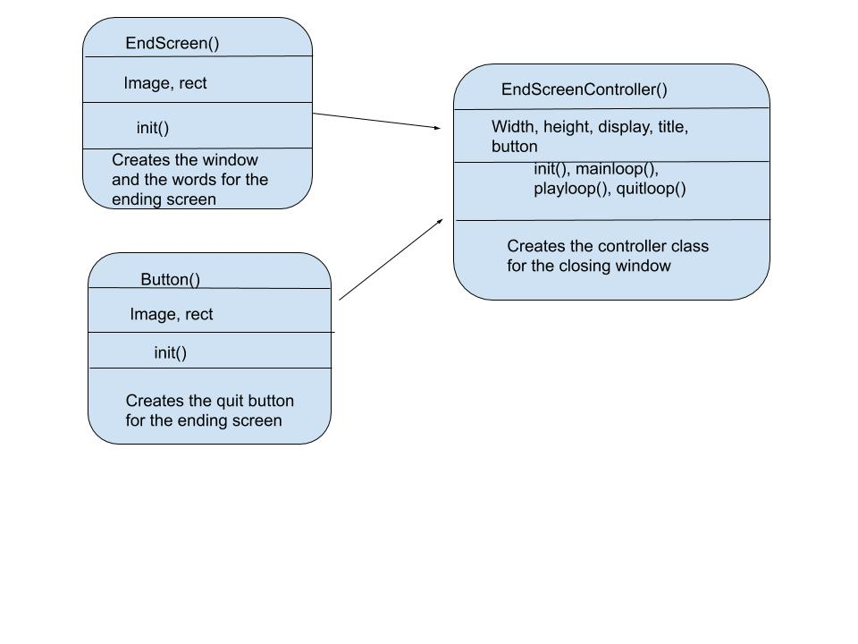
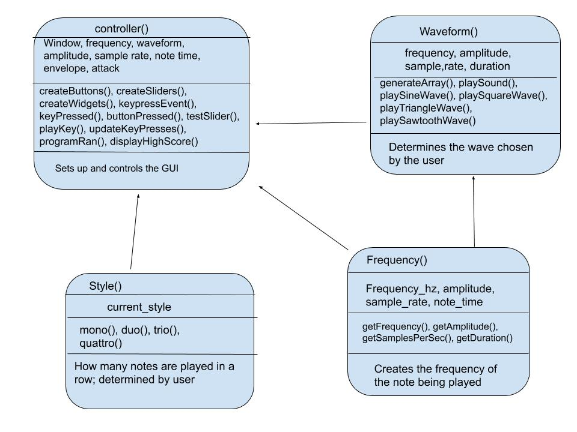

# Audio Synthesizer  
# CS 110 Final Project  
  
Fall Semester, 2020  
* [Presentation Slides](https://docs.google.com/presentation/d/11doH-pEIlNu8o0rZCI710lA3XartpkvQP_a9EsegQdU/edit#slide=id.p)  
* https://github.com/bucs110/final-project-fall20-lenny-s-disciples  
  
## Team: Lenny's Disciples  
* Brian Matzelle  - Software Lead
* Nicole Masciovecchio - Front End Specialist
* Kenechi Okoye - Back End Specialist
  
## Project Description  
  
This project is an audio synthesizer that plays sound based on the keyboard inputs of the user. There are also different effects and adjustments that can be made on the several different waveforms provided. These adjustments include changing the wave style which changes the type of sound being produced as well as an arpeggiator which cycles through a series of notes based on the user input.  
  
## User Interface Design  
  
First: Main Synthesizer Window  
  
This screen is the first screen that the user sees which is the audio synthesizer. The user is prompted to press the keys on their keyboard to create music. The user can also choose between different waveform and arpeggiator styles which change the sound of the keys being pushed. We mainly used tkinter for this GUI because it was much more comprehensible than creating each individual button and slider in pygame. It was also easier to play music through the tkinter because we could use the user's keyboard as input for the sound.  
  

  
Second: Closing Screen  
  
This screen thanks the user for playing and shows the names of the team members. There is also a big quit button that closes the program.  
  
  
  
  
## Program Design  
  
 - Non-Standard Libraries  
   - [numpy](https://numpy.org/doc/stable/) - allows for more difficult math to be calculated  
   - [simpleaudio](https://pypi.org/project/simpleaudio/) - allows for the program to output sound, specifically focuses on arpeggios  
   - [time](https://docs.python.org/3/library/time.html) - allows for the sounddevice to be used, determines the length of the audio wave
   - [sounddevice](https://python-sounddevice.readthedocs.io/en/0.4.1/) - allows for volume to be changed, plays Mono notes
      
- Pygame Class Interface Design  
  
  
- Tkinter Class Interface Design

      
- Classes  
  - Waveform - Determines the waveform that the user has picked, plays single notes and apreggios. Arpeggios cycle through a series of notes, which basically plays a chord, note after note another when the user presses an input key 
  - Style - Determines how many notes are played in a row based off user input
  - Controller - This class outlines everything needed to run the program. It creates the widgets on the screen for the user to press as well as connects the back end code.
  - Frequency - Determined frequency of the note being played
  - Button - This is a small class that creates the quit button for the closing screen.  
  - EndScreen - This is another small class that creates the words that pop up on the closing screen.  
  - EndScreenController - This class outlines the aspects of the closing pygame screen. In includes a main loop, when the screen is still projected, and and a quit loop, when the screen is exited.   
    
## Tasks and Responsibilities  
  
### Software Lead - Brian Matzelle  
  * Scheduled meetings
  * Mapped out the direction of the program, planning out Classes and Methods
  * Made sure all processes on the front and back end were compatible
  * Collaborated with the back end specialist in controller.py and Waveform.py
	  * Specifically collaborated on createWidgets(), createSlider(), testSlider(), and playMono()
  * Responsible for methods that pertain to the volume slider
  * Researched data that would be necessary so the Styles could be implemented
  * Implemented modules sounddevice and time
  * Created the ATP and wrote the proposal for the README file
  
### Front End Specialist - Nicole Masciovecchio  
  * Conducted significant research on creating and formatting the GUI
  * Built the exit window so tkinter could launch into pygame
  * Responsible for creating StartUpController.py, StartUpScreen.py, and Button.py
  * Collaborated with the back end specialist and the software lead to make the GUI smooth and responsive
  * Transformed the planned layout of classes into code, so it could easily be used later
  
### Back End Specialist - Kenechi Okoye  
  * Took the initiative of implementing much of the back end logic
  * Researched a lot about waves, and the math behind them
  * Communicated what would be possible to create, and what was unlikely
  * Responsible for much of the back end logic in Waveform.py, controller.py, Style.py, Frequency.py, and all other methods that were not previously listed
  * Collaborated with the software lead and front end specialist to design the GUI, and implement the back end for it
  * Created scores.json, which allows for the key presses to be logged and stored.
  
## Testing  
* When testing ourselves, it was important to test every feature and know what was happening down to the lowest level. This meant that testing was done very frequently, to ensure that the code performed well.
### ATP Testing, With The User in Mind
* The testing strategy aims to teach the tester the basics of the program, then allow room for experimentation with every feature.  
  * For example, the ATP shows the capabilities of the program, wishing the user to play melodies and be creative.
  * Furthermore, it is implied that the features in Style can be used on every key, just as the keyboard piano feature that was shown before.  
  * Given that there is a time limit for the presentation, features needed to be implied, because it would take way to long to show every combination of waves, keys, and arpeggios.
* ATP

| Step                  | Procedure     | Expected Results  | Actual Results |  
| ----------------------|:-------------:| -----------------:| -------------- |  
|  1  | Run Synthesizer Program | GUI window appears with sections: Waveforms, Style, and Volume, and Stats |   |
|  2  | Under the Waveforms box, click Sine | program selects "Sine" to be the selected audio wave |               |
|  3  | Under the Waveforms box click Sine, then press D | program outputs an audio sine wave at the note C  |      |
|  4  | Under the Waveforms box click Sawtooth, then press D | program outputs an audio sawtooth wave at the note C  |     |
|  5  | Under the Waveforms box click Triangle, then press D | program outputs an audio triangle wave at the note C  |     |
|  6  | Under the Waveforms box click Square, then press D | program outputs an audio square wave at the note C  |     |
|  7  | Press R | program outputs the selected audio wave at note C# |       |
|  8  | Press F | program outputs the selected audio wave at note D |        |
|  9  | Press T | program outputs the selected audio wave at note D# |       |
|  10  | Press G | program outputs the selected audio wave at note E |       |
|  11  | Press H | program outputs the selected audio wave at the note F |       |
|  12  | Press U | program outputs the selected audio wave at note F# |      |
|  13  | Press J | program outputs the selected audio wave at note G |       |
|  14  | Press I | program outputs the selected audio wave at note G# |      |
|  15  | Press K | program outputs the selected audio wave at note A |       |
|  16  | Press O | program outputs the selected audio wave at note A# |      |
|  17  | Press L | program outputs the selected audio wave at note B |       |
|  18  | Press ; | program outputs the selected audio wave at note C2 |      |
|  19  | Under Volume, adjust the Slider down, then tap D | program outputs the selected audio wave at a lower volume, at note C |        |
|  20  | Under Volume, reset the Slider all the way up, then tap D | program outputs the selected audio wave at the default volume, at note C |        |      |
|  21  | Under Style, click Duo, then tap D | program arpeggiates notes C and E with the selected audio wave |                        |
|  22  | Under Style, click Trio, then tap D | program arpeggiates a major chord, here the notes being C, E, and G |                  |
|  23  | Under Style, click Quattro, then tap D | program arpeggiates a major 7th chord, here the notes being C, E, G , and B |       |
|  24  | Under Style, click Mono, then tap D | program plays a single C note |            |
|  25  | click quit button | tkinter GUI window disappears, and Pygame GUI goodbye window appears |          |
|  26  | click quit button | Pygame GUI window disappears |                  |
